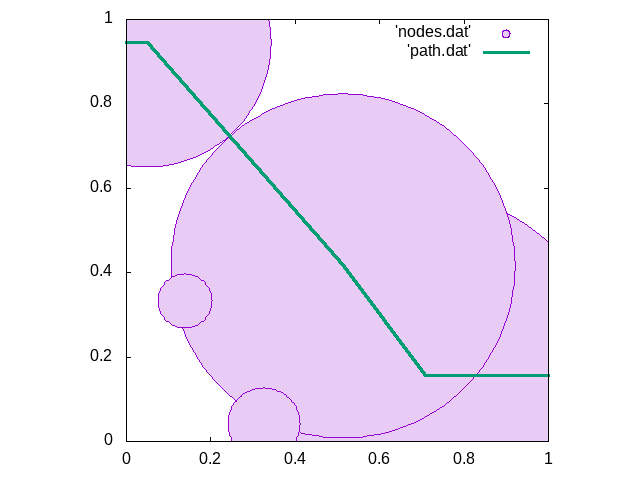

# Graphene Oxide Percolation Analysis

This program takes an idealised square graphene flake and propogates an oxidation reaction based on the finding in the research by Sinclair (currently in review). Oxidised islands are nucleated systematically and graphene oxide areas propogate from these points. The simulation stops when the percolation threshold has been reached. Ensembles of these systems give an average impression on when graphene's properties are degrated. 

Generate the simplest simulation with:
```
python2.7 command.py
```
`command.py` simply runs one simulation and prints a summary of the simulation, for eample:
```
Coverage   = 0.6266
Nsites     = 8
Max radius = 0.268
Corrected coverage = 0.62395
Error      = 0.00265
```
The `Coverage` is the fraction of the squre covered by islands when a path was made from one edge to its oposite. The `Corrected coverage` is the half way between the coverage above and the coverage on the previous step; the `Error` is half the difference between these values.

`Nsites` is the number of islands, `Max radius` is the size of the largers island.

Two files are also written: `nodes.dat` and `path.dat`. These record respectively the location and size of the islands, and the shortest path from one edge to its opposite. These can be visually inspected using gnuplot with:
```
gnuplot> set size square; set xr [0:1]; set yr [0:1]
gnuplot> pl 'nodes.dat' w circ, 'path.dat' w l
```

 

### Ensembles

In the directory `scripts_for_paper` are tools for running and analysing ensembles of these simulations.

`ensemble.py` will run a given number of simulations, `epochs`, and collate the coverages and errros into two files `coverages.dat` and `errors.dat`. To sweep several rates of nucleation (chi in the paper) we used a simple bash script to execute them `sub.sh`.

The resultant directories created with `sub.sh` can be analysed with `analyse.py` which will calculate the average coverages at percolation thresholds, distributions, standard deviations and confidence in these coverages. 
